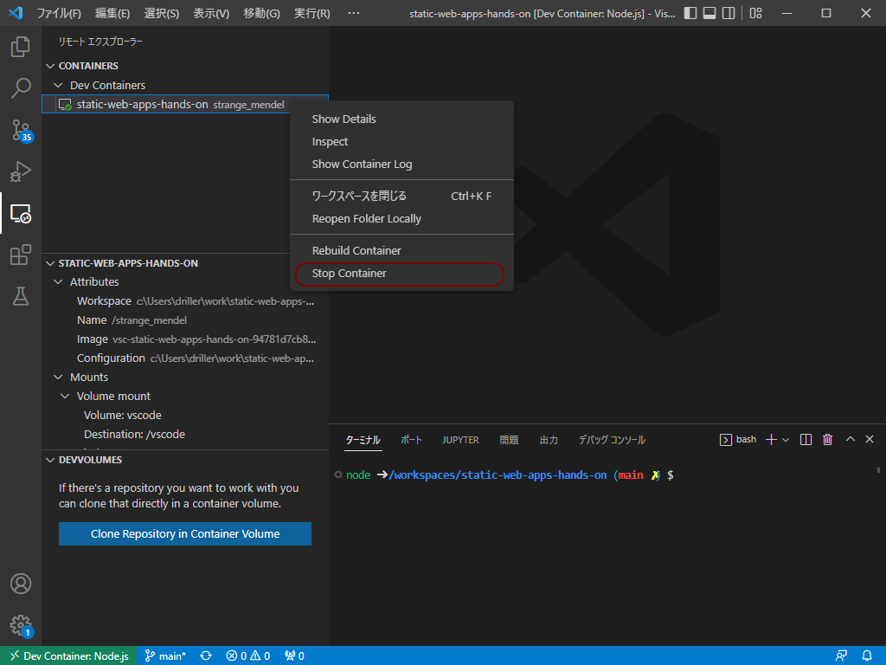
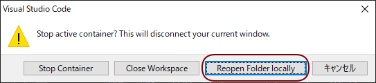
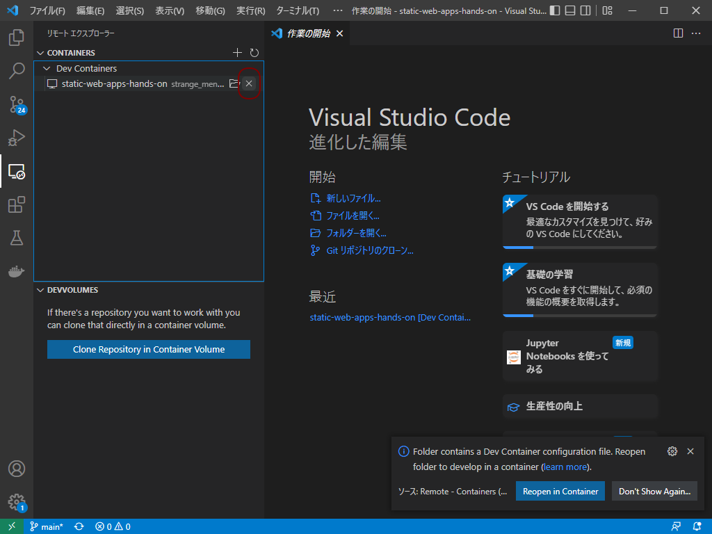

あとしまつ
==========

本節では、ハンズオンで利用した環境を削除します。

VS Codeのリモート エクスプローラーから、 `static-web-apps-hands-on` のコンテナを右クリックし、 `Stop Container` をクリックします。

   Stop Container

:numref:`reopen-folder-locally` の画面では `Reopen Folder locally` をクリックします。

   Reopen Folder locally

リモート エクスプローラーから、 `static-web-apps-hands-on` のコンテナを右クリックし、 `☓` （ `Remove Container` ）をクリックします（ :numref:`remove-container` )
。

   Remove Container
