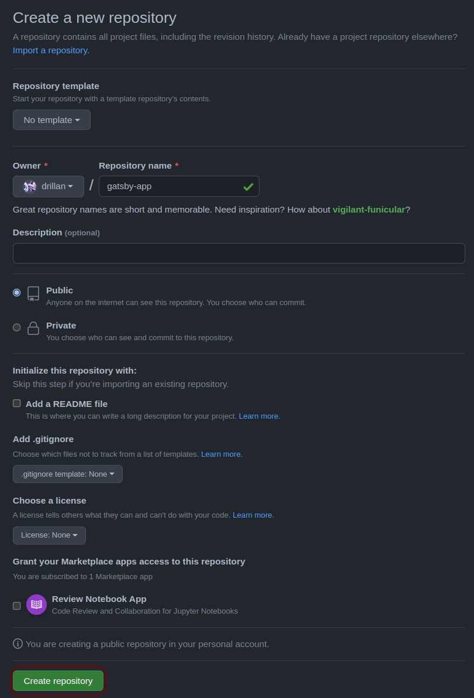
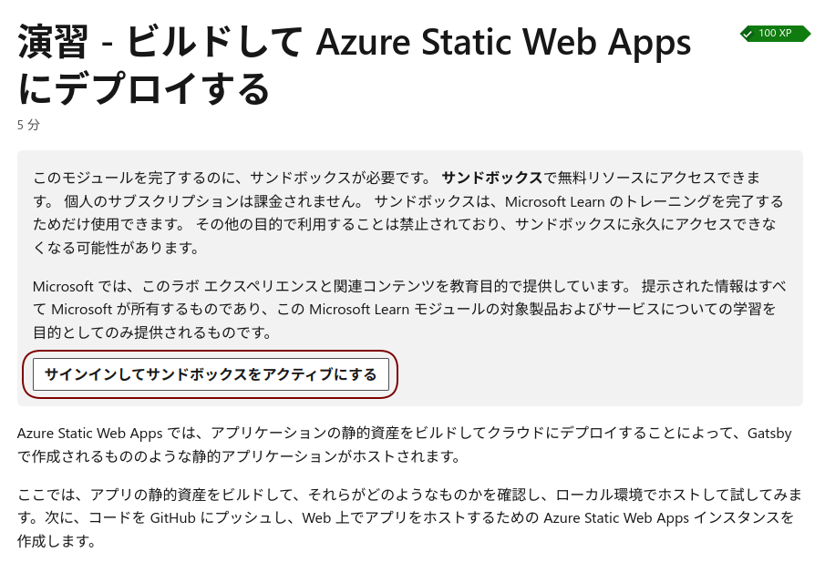
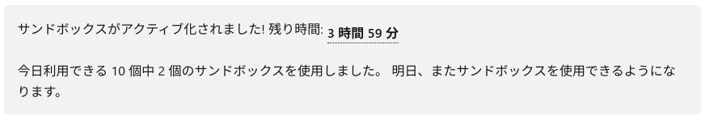
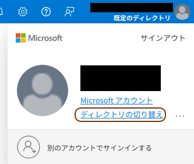
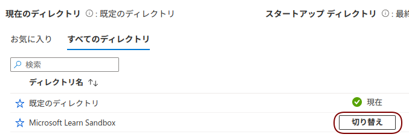

演習 - Gatsbyで作成した静的Webアプリをデプロイ
==============================================

本節では、MS learnの `Gatsby と Azure Static Web Apps で静的 Web アプリを作成して発行する <https://docs.microsoft.com/ja-jp/learn/modules/create-deploy-static-webapp-gatsby-app-service/>`_ を一部抜粋した内容を実施します。

Gatsbyを使用して静的アプリを作成
--------------------------------

VS Codeのターミナルから、 :numref:`install-gatsby` を実行して、Gatsbyをインストールします。

.. code-block:: bash
   :name: install-gatsby
   :caption: Gatsbyのインストール

   npm install -g gatsby-cli

:numref:`create-gatsby-app` を実行して、Gatsbyアプリを作成します。

.. code-block:: bash
   :name: create-gatsby-app
   :caption: Gatsbyアプリの作成

   gatsby new myApp

:numref:`run-gatsby-server` を実行して、サーバを起動します。

.. code-block:: bash
   :name: run-gatsby-server
   :caption: サーバの起動

   cd myApp
   gatsby develop

ブラウザを開き、 http://localhost:8000 に移動します。

ビルドしてAzure Static Web Appsにデプロイ
-----------------------------------------

サイトをビルドしてデプロイできる状態にするときの面倒な作業は、Gatsby によって自動的に行われます。

:numref:`build-gatsby` を実行して、サイトをビルドします。

.. code-block:: bash
   :name: build-gatsby
   :caption: サイトのビルド

   gatsby build

:numref:`run-http-server` を実行して、http-serverを起動します。

.. code-block:: bash
   :name: run-http-server
   :caption: http-serverの起動

   cd public
   npx http-server -p 5000

ブラウザで http://localhost:5000 にアクセスし、Webサイトが閲覧できることを確認します。

https://github.com/new にアクセスして、GitHubリポジトリを作成します。

`Repository name` に `gatsby-app` を入力して、 `Create repository` をクリックします。

   GitHubリポジトリの作成

ディレクトリを `static-web-apps-hands-on/myApp` に移動し、 :numref:`push-repository` を実行して、コードをGitHubリポジトリにプッシュします。

.. code-block:: bash
   :name: push-repository
   :caption: GitHubリポジトリにプッシュ

   cd ..
   git init
   git add .
   git commit -m "first commit"
   git branch -M main
   git remote add origin https://github.com/<your-github-username>/gatsby-app.git
   git push -u origin main

MS learnの `演習 - ビルドして Azure Static Web Apps にデプロイする <https://docs.microsoft.com/ja-jp/learn/modules/create-deploy-static-webapp-gatsby-app-service/7-exercise-build-deploy-static-app>`_ にアクセスし、 `サンドボックスをアクティブ化` をクリックします（ :numref:`sign-in-to-activate-sandbox` ）。

   サンドボックスをアクティブ化

サンドボックスがアクティブ化されると、残り時間が表示されます（ :numref:`activated-sandbox` ）。

   サンドボックスがアクティブ化

`Azure portal <https://portal.azure.com/learn.docs.microsoft.com>`_ にサインインします。

右上のアカウント画面から、 `ディレクトリの切り替え` をクリックします（ :numref:`switch-directory` ）。

   ディレクトリの切り替え

「ポータルの設定 | ディレクトリとサブスクリプション」の画面で、 `Microsoft Learn Sandbox` に切り替えます（ :numref:`switch-ms-learn-sandbox` ）。

   MS Learn Sandboxに切り替え

次の手順で静的 Web アプリの作成画面に遷移します。

1. 上部のバーで「Static Web Apps」を検索し、 `静的 Web アプリ` をクリック
2. 作成をクリック

次に、新しいアプリを構成し、GitHub リポジトリにリンクします。

プロジェクトの詳細
  - サブスクリプション: `Concierge Subscription`
  - リソースグループ: `learn-bcc1d89a-f8ad-44ed-8a36-9a439f3b3f2b`

静的Webアプリの詳細
  - 名前: アプリの名前を指定します。 有効な文字は a-z (大文字と小文字は区別されません)、0-9、および _ です

ホスティング プラン
  - プランの種類: `Free: 趣味または個人的なプロジェクト用`

Azure Functions とステージングの詳細
  - Azure Functions APIとステージング環境: `East Asia`

デプロイの詳細
  - ソース: `GitHub`
  - GitHub アカウント: `<your-github-username>`
  - 組織:  `<your-github-username>`
  - リポジトリ: `gatsby-app`
  - 分岐: `main`

ビルドの詳細
  - ビルドのプリセット: `Gatsby`
  - アプリの場所: デフォルト
  - 出力先: `public`

`確認および作成` ボタンをクリックします（ :numref:`review-create-button` ）。

.. figure:: https://docs.microsoft.com/ja-jp/learn/modules/create-deploy-static-webapp-gatsby-app-service/media/review-create-button.png
   :name: review-create-button

   確認および作成

`作成` ボタンをクリックします（ :numref:`create-button` ）。

.. figure:: https://docs.microsoft.com/ja-jp/learn/modules/create-deploy-static-webapp-gatsby-app-service/media/create-button.png
   :name: create-button

   作成

デプロイが完了したら、 `リソースに移動` ボタンをクリックします（ :numref:`go-to-resource-button` ）。

.. figure:: https://docs.microsoft.com/ja-jp/learn/modules/create-deploy-static-webapp-gatsby-app-service/media/go-to-resource-button.png
   :name: go-to-resource-button

   リソースに移動

.. note::
    
    この段階では、Static Web AppsインスタンスがAzureに作成されていますが、アプリはまだデプロイされていません。 Azure によってリポジトリに作成されるGitHubActionsは自動的に実行され、アプリの最初のビルドとデプロイが実行されますが、完了するまでに数分かかります。

:numref:`static-app-portal` に示されているリンクをクリックして、ビルドとデプロイ アクションの状態を確認できます。

.. figure:: https://docs.microsoft.com/ja-jp/learn/modules/create-deploy-static-webapp-gatsby-app-service/media/static-app-portal.png
   :name: static-app-portal

   GitHub Actionsの確認

GitHub ActionsによってWebアプリのビルドと発行が完了すると、実行中のアプリを参照して確認できるようになります。

リソースの概要からURLリンクをクリックして、ブラウザでアプリにアクセスします（ :numref:`static-app-portal-finished` ）。

.. figure:: https://docs.microsoft.com/ja-jp/learn/modules/create-deploy-static-webapp-gatsby-app-service/media/static-app-portal-finished.png
   :name: static-app-portal-finished

   静的WebアプリのURL
