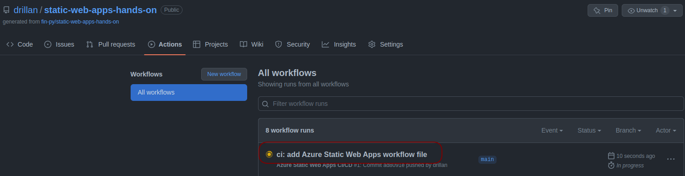
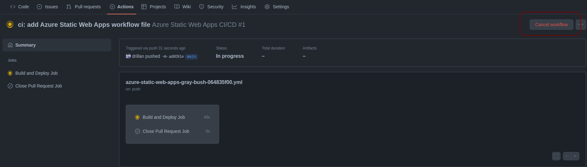
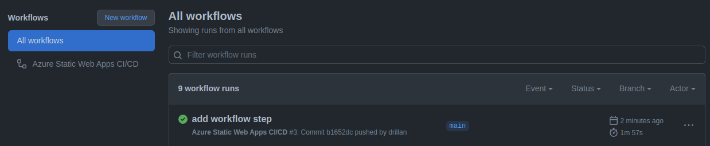

演習 - Sphinxで作成した静的Webアプリをデプロイ
==============================================

本節では、この資料のSphinxドキュメントを静的Webアプリとしてデプロイします。

ドキュメントのビルド
--------------------

ローカルPC上にドキュメントをビルドします。

:numref:`make-html` のコマンドを実行し、SphinxドキュメントをHTML形式でビルドします。

.. code-block:: bash
   :name: make-html
   :caption: Sphinxドキュメントのビルド

   cd docs
   make html

:numref:`run-http-server-python` のコマンドを実行して、http-serverを起動します。

.. code-block:: bash
   :name: run-http-server-python
   :caption: http-serverの起動

   python -m http.server --directory build/html/

ブラウザで http://localhost:8000 にアクセスし、Webサイトが閲覧できることを確認します。

Azure Static Web Appsにデプロイ
-------------------------------

`Azure portal <https://portal.azure.com/learn.docs.microsoft.com>`_ にサインインします。

次の手順で静的 Web アプリの作成画面に遷移します。

1. 上部のバーで「Static Web Apps」を検索し、 `静的 Web アプリ` をクリック
2. 作成をクリック

次に、新しいアプリを構成し、GitHub リポジトリにリンクします。

プロジェクトの詳細
  - サブスクリプション: `Concierge Subscription`
  - リソースグループ: `learn-bcc1d89a-f8ad-44ed-8a36-9a439f3b3f2b`

ホスティング プラン
  - プランの種類: `Free: 趣味または個人的なプロジェクト用`

静的Webアプリの詳細
  - 名前: アプリの名前を指定します。 有効な文字は a-z (大文字と小文字は区別されません)、0-9、および _ です

Azure Functions とステージングの詳細
  - Azure Functions APIとステージング環境: `East Asia`

デプロイの詳細
  - ソース: `GitHub`
  - GitHub アカウント: `<your-github-username>`
  - 組織:  `<your-github-username>`
  - リポジトリ: `static-web-apps-hands-on`
  - 分岐: `main`

ビルドの詳細
  - ビルドのプリセット: `Custom`
  - アプリの場所: `docs/build/html`
  - 出力先: `public`

`確認および作成` ボタンをクリックします（ :numref:`review-create-button2` ）。

.. figure:: https://docs.microsoft.com/ja-jp/learn/modules/create-deploy-static-webapp-gatsby-app-service/media/review-create-button.png
   :name: review-create-button2

   確認および作成

`作成` ボタンをクリックします（ :numref:`create-button2` ）。

.. figure:: https://docs.microsoft.com/ja-jp/learn/modules/create-deploy-static-webapp-gatsby-app-service/media/create-button.png
   :name: create-button2

   作成

GitHubリポジトリの `Actions` タブから実行しているワークフローをクリックします（ :numref:`all-workflows` ）。

   GitHub Actionsのワークフロー

`Cancel workflow` クリックし、ワークフローをキャンセルします（ :numref:`cancel-workflow` ）。

   ワークフローのキャンセル

.. note::

   現時点のワークフローではドキュメントのビルド操作を行っていないため、設定した「アプリの場所」にアプリケーションがビルドされていないため、ワークフローが失敗します。

リポジトリ直下のディレクトリに移動し、生成された `.github/workflows/xxx.yml` ファイルをプルします（ :numref:`git-pull` ）。

.. code-block:: bash
   :name: git-pull
   :caption: ワークフローのYAMLファイルのプル

   cd ..
   git pull origin main

`.github/workflows/xxx.yml` ファイルに :numref:`workflows-yaml` の `+` から始まっている行を追記します（ :numref:`workflows-yaml` ）。
**+は記述しません** 

.. code-block:: yaml
   :name: workflows-yaml
   :caption: ワークフローのYAMLファイル

        - uses: actions/checkout@v2
            with:
            submodules: true
    +   - name: Sphinx Build
    +     uses: ammaraskar/sphinx-action@master
    +     with:
    +       docs-folder: "docs/"
    +       pre-build-command: "pip install -r requirements.txt"
        - name: Build And Deploy
            id: builddeploy
            uses: Azure/static-web-apps-deploy@v1

変更をコミットし、プッシュします（ :numref:`commit-push-workflow` ）。

.. code-block:: bash
   :name: commit-push-workflow
   :caption: 変更の反映

   git add .
   git commit -m "add workflow step"
   git push origin main

GitHubリポジトリの `Actions` タブから実行しているワークフローが正常に完了していることを確認します。

   
   ワークフローの確認

リソースの概要からURLリンクをクリックして、ブラウザでアプリにアクセスします（ :numref:`static-app-portal-finished2` ）。

.. figure:: https://docs.microsoft.com/ja-jp/learn/modules/create-deploy-static-webapp-gatsby-app-service/media/static-app-portal-finished.png
   :name: static-app-portal-finished2

   静的WebアプリのURL
